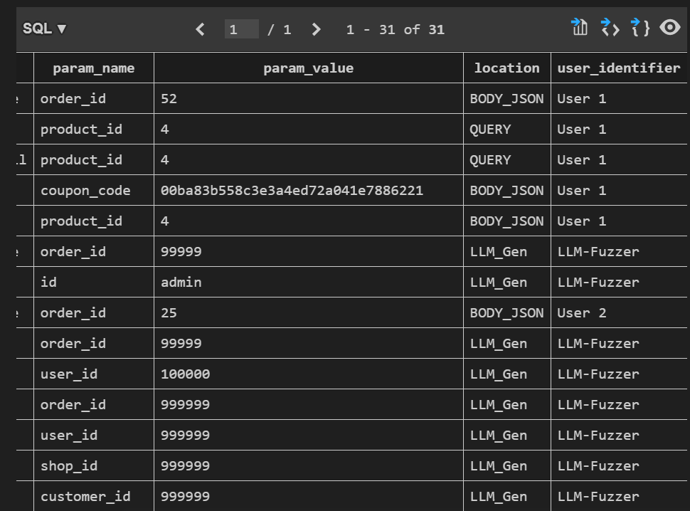
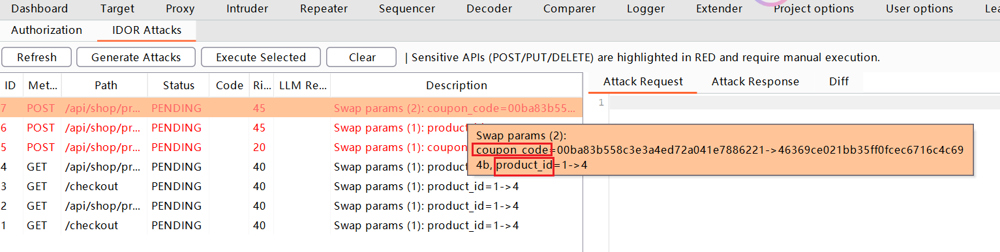
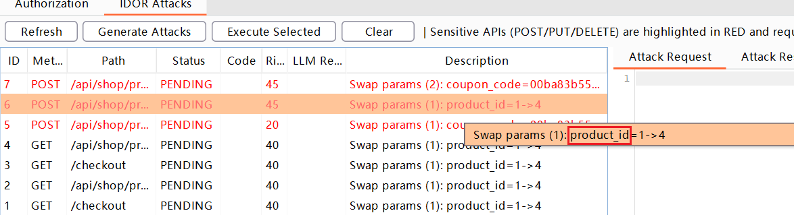
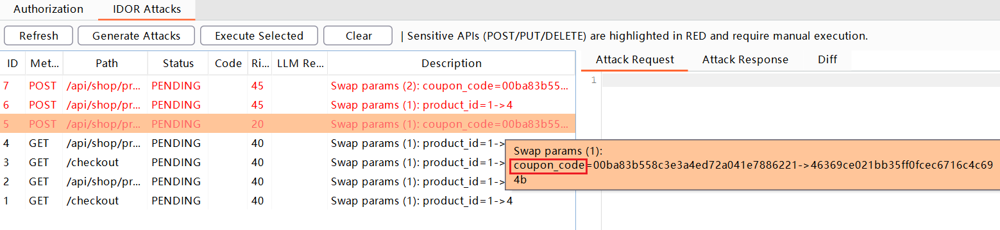
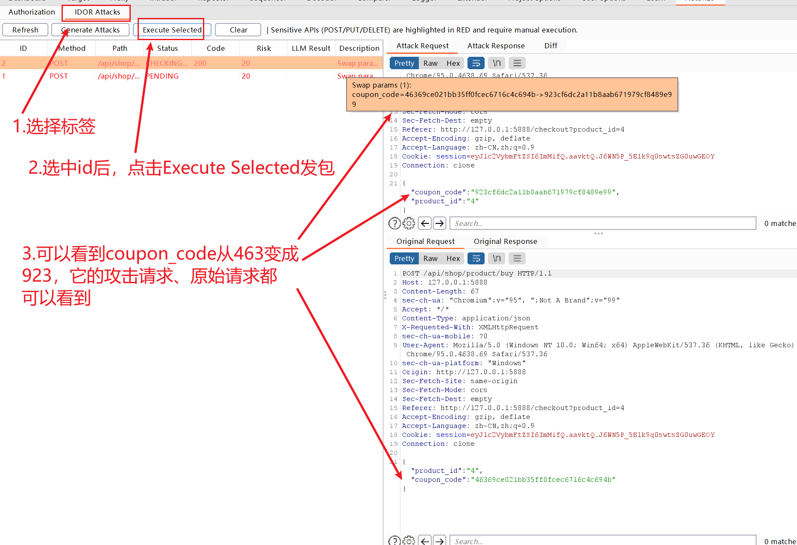
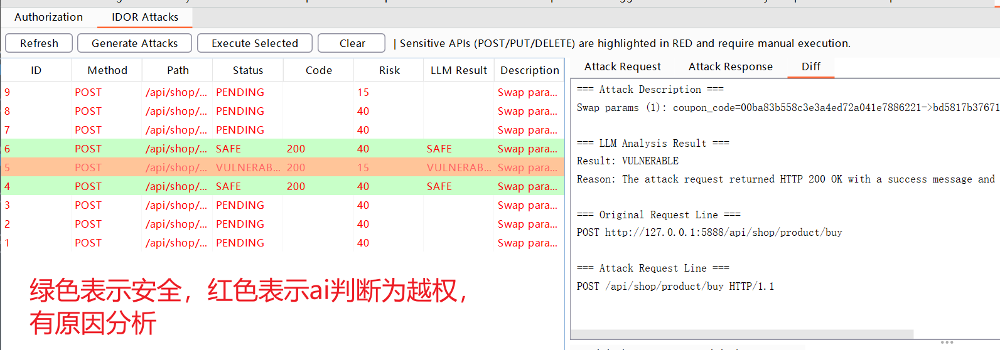

# Autorize + IDOR Detection Plugin

本插件是在原版 Autorize 基础上进行的二次开发，新增了 **智能越权 (IDOR) 检测** 功能。它通过采集不同用户的流量，自动分析参数特征，并构造重放攻击来检测越权漏洞。

## 主要功能

1.  **多用户流量采集**: 自动识别并区分 User A（攻击者）和 User B（受害者）的流量。
2.  **智能参数提取**: 自动从流量中提取 URL 路径参数、Query 参数和 JSON Body 参数。
3.  **越权攻击重放**: 基于提取的参数，自动构造并发送越权探测请求。
4.  **智能结果分析**: 结合状态码分析与 LLM（大模型）辅助判断，准确识别越权漏洞。

## 安装指南

由于本插件使用了 SQLite 数据库来存储大量分析数据，在 Jython 环境下运行需要额外的 JDBC 驱动配置。

### 1. 环境要求
- **Burp Suite**: Professional 或 Community 版本。
- **Jython**: 版本 2.7.x (推荐 2.7.3)。

### 2. Jython 环境配置 (必须!)
如果您尚未在 Burp Suite 中配置 Python 环境，请按照以下步骤操作：

1.  **下载 Jython**:
    - 访问 [Jython 官网](https://www.jython.org/download) 下载 **Jython Standalone JAR** (例如 `jython-standalone-2.7.3.jar`)。
    - 将下载的 JAR 文件保存到您方便管理的目录中。

2.  **配置 Burp Python 环境**:
    - 在 Burp Suite 中，点击顶部菜单 **Extensions** (旧版为 Extender) -> **Extensions settings** (或 Options)。
    - 找到 **Python Environment** 设置区域。
    - 点击 **Select file**，选择刚才下载的 `jython-standalone-2.7.3.jar` 文件。

### 3. JDBC 驱动配置 (必须!)
由于 Jython 不包含 C 语言实现的 `sqlite3` 模块，我们需要使用 Java 的 JDBC 驱动。**本插件已内置该驱动，您无需额外下载。**

1.  **定位驱动文件**:
    - 插件目录下的 `lib` 文件夹中已包含 `sqlite-jdbc-3.42.0.0.jar`。
    - 路径示例: `E:\idors-tools\test\Autorize\lib`

2.  **配置 Burp Java 环境 (关键步骤)**:
    - 在 Burp Suite 中，点击顶部菜单 **Extensions** -> **Extensions settings**。
    - 找到 **Java Environment** 设置区域。
    - 在 **Folder for loading library JARs** (加载库 JAR 的文件夹) 中，点击 **Select folder**。
    - 选择本插件的 `lib` 目录：`E:\idors-tools\test\Autorize\lib`。
    - **重启 Burp Suite** (或重新加载插件) 以使更改生效。

### 4. 加载插件
1.  打开 Burp Suite -> **Extensions** -> **Add**。
2.  Extension type 选择 **Python**。
3.  Extension file 选择 `E:\idors-tools\test\Autorize\Autorize.py`。
4.  点击 Next，确保 Output 标签页没有报错。

## 使用说明

### 第一阶段：流量采集 (Traffic Collection)

1.  **配置用户标识**:
    - 加载插件后，进入 **Autorize** 标签页 -> **Users** 子标签页。
    - 添加用户（如 User A 和 User B），并分别配置他们的 Cookie/Token。
    - 确保在 Header配置中填写能唯一标识该用户的字符串（例如 Cookie 中的 `session=UserA`），以便插件自动归类流量。

2.  **生成流量**:
    - 打开浏览器，配置好 Burp 代理。
    - 登录 User A 账号，访问业务页面（如“个人中心”、“订单列表”）。
    - 登录 User B 账号，访问**相同**的业务页面。
    - 插件会自动检测流量并记录到数据库中。

### 第二阶段：参数提取 (Parameter Extraction)

1.  **自动提取**:
    - 插件会在后台自动分析采集到的流量。
    - 点击 **Configuration** -> **Extract Params** 按钮可手动触发提取。
    - **新增进度条**: 操作过程中，下方进度条会实时显示 "Extracting Parameters..." 状态。
    - 插件会识别 URL 路径参数（如 `/users/123` 中的 `123`）、Query 参数（`?id=123`）以及 JSON Body 中的参数。
   如果启用了LLM,LLM会进行参数的构造尝试，如下图，
   
   可以看到数据库中有LLM自动生成的fuzz结果

### 第三阶段：攻击生成 (Attack Generation)

1.  **生成攻击**:
    - 切换到 **IDOR Attacks** 标签页（或在 Configuration 页点击 **Generate Attacks**）。
    - **智能排列组合**: 插件会自动分析 User A 的请求，尝试将其中的敏感参数（如 ID、User Code 等）替换为 User B 的对应值。
    - **组合策略**: 如果一个请求中有多个可替换参数（例如 `user_id` 和 `order_id`），插件会生成所有可能的组合（仅替换 `user_id`、仅替换 `order_id`、同时替换两者），以确保覆盖各种测试场景。
    - **后台处理**: 点击生成按钮后，进度条会滚动显示 "Generating Attacks..."，生成完毕后自动刷新列表。
    - 生成的攻击列表会显示在左侧表格中。

### 第四阶段：执行与检测 (Execution & Detection)

1.  **审查攻击列表**:
    - 在 **IDOR Attacks** 面板中查看生成的攻击向量。
    - **高危操作高亮**: 涉及敏感操作（如 `POST`, `PUT`, `DELETE` 方法或路径包含 `delete`, `update` 等关键词）的 API 会以 **红色高亮** 显示，提示测试人员需人工确认后再执行，避免误删数据。

2.  **执行攻击**:
    - 选中一条或多条攻击记录。
    - 点击 **Execute Selected** 按钮。
    - 插件会重放请求：保持 User A 的 Session（Cookie/Header），但参数已替换为 User B 的值。
    - **自动刷新**: 执行完成后，右侧详情面板会自动刷新，显示最新的响应结果。

    替换值的规则是：将重要度超过阈值的所有参数，1个或多个，（排列组合）替换为b相应的参数，假如一个请求有2个参数且均超过阈值，会排列组合产生3个数据包，如下：



    使用指南


3.  **结果分析 (右侧详情面板)**:
    - **Attack Request/Response**: 查看实际发送的攻击请求及其响应。
    - **Original Request/Response**: 查看原始请求（User A 的正常请求）及其响应，方便对比。
    - **Diff 面板**: 清晰对比原始请求与攻击请求的关键差异（如参数替换情况）。
    - **状态与颜色**:
        - **绿色 (SAFE)**: 攻击失败，目标安全（响应码与原始请求一致或被拒绝）。
        - **红色 (VULNERABLE)**: 攻击成功，存在越权漏洞（需开启 LLM 辅助判断或根据状态码差异）。
        - **黄色 (SENT)**: 请求已发送，等待进一步分析。
    - **LLM 智能分析**:
        - 在 **Configuration** 中配置 LLM (OpenAI 兼容接口)。
        - 开启 LLM 后，插件会自动将原始请求、攻击请求及响应发送给模型，由 AI 判断是否存在越权风险。
        颜色不同表示ai分析结果不同，如下图所示
        

## AI 智能分析功能详解 (AI-Powered Analysis)

本插件深度集成了 LLM (大语言模型) 能力，旨在解决传统正则匹配的局限性。AI 功能模块化设计，提供四个独立的子功能开关，您可以根据需求灵活配置。

### 1. 配置与测试
- **设置**: 在 **Configuration** 标签页填写 `LLM Base URL` (如 `https://api.openai.com/v1`)、`LLM API Key` 和 `Model` (如 `gpt-3.5-turbo`)。
- **连接测试**: 点击 **Test LLM** 按钮，插件会发送一个简单的测试请求。测试结果（Success/Failed）将实时显示在下方的进度条中，帮助您快速验证配置是否正确。

### 2. 四大核心 AI 功能

#### A. 辅助参数提取 (Assist Param Extraction)
- **原理**: 传统的正则提取容易漏掉嵌套在复杂 JSON 结构或非标准格式中的参数。开启此功能后，插件会将未识别的请求内容发送给 LLM。
- **效果**: AI 能够理解语义，提取出如 `user_code`, `account_uuid` 等非常规命名的敏感参数，并将其加入参数池供后续攻击使用。

#### B. 构造参数值 (Generate Param Values)
- **原理**: 仅替换捕获到的参数值可能覆盖不全（例如只有 ID `100` 和 `101`）。开启此功能后，LLM 会基于上下文生成具有针对性的测试值（Fuzzing Payloads）。
- **效果**:
    - 针对数字 ID，生成边界值（如 `0`, `-1`, `999999`）。
    - 针对 UUID，生成格式正确但随机的新 UUID。
    - 生成结果会自动存入数据库，参与后续的攻击排列组合。
    

#### C. 高危接口识别 (Identify High-Risk APIs)
- **原理**: 并非所有接口都值得重点关注。LLM 会分析请求的方法、路径和参数，判断该接口是否涉及敏感操作（增删改、支付、隐私查询）。
- **效果**:
    - 被 AI 判定为 **High Risk** 的接口，在 **IDOR Attacks** 列表中会以 **红色字体** 高亮显示。
    - 这有助于测试人员优先审查高危接口，避免漏测关键业务，同时在执行删除/修改操作前保持警惕。

#### D. 攻击结果分析 (Analyze Attack Results)
- **原理**: 依靠状态码（如 200 vs 403）判断越权往往存在误报（如“伪 200”：状态码 200 但内容是 "Permission Denied"）。
- **效果**:
    - 开启此功能后，执行攻击（Execute Selected）时，插件会将 **原始请求/响应** 与 **攻击请求/响应** 打包发送给 LLM。
    - LLM 会对比响应内容的语义差异，判断攻击是否成功。
    - **结果展示**:
        - **状态列**: 更新为 `VULNERABLE` (红), `SAFE` (绿), 或 `UNCERTAIN`。
        - **Diff 面板**: 在右侧 Diff 标签页中，会直接显示 AI 的分析结论和推理过程（Reason），方便人工复核。
        ```text
        === LLM Analysis Result ===
        Result: VULNERABLE
        Reason: The attack response contains user profile data identical to the structure of the victim's data, indicating successful unauthorized access.
        ```

